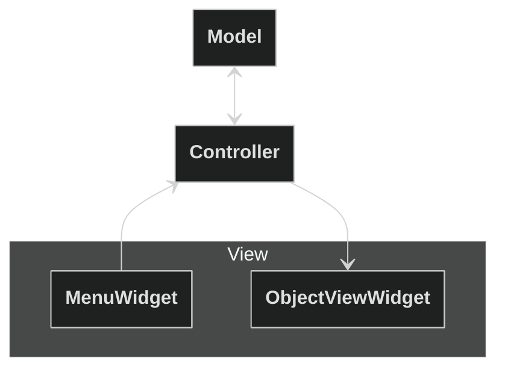
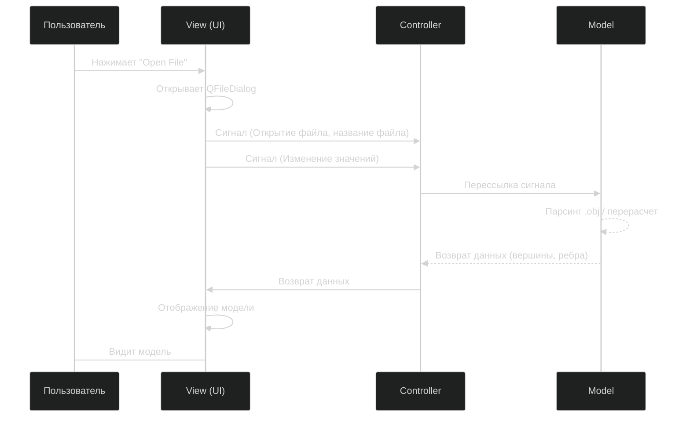
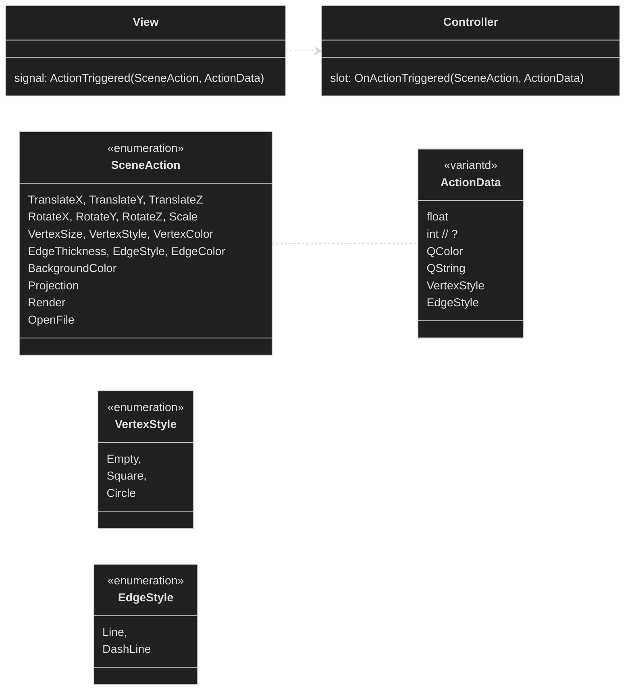
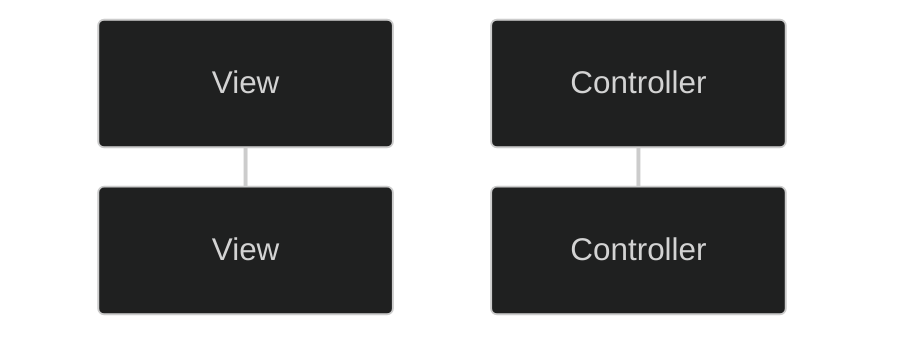

# Архитектура программы 3DViewer

В данном файле представлен состав модулей программы и их взаимодействие

### Модули программы:

```mermaid
%%{init: {'theme': 'dark', 'class': {'hideEmptyMembersBox': true}}}%%
classDiagram

 namespace View {
  class MenuWidget
  class ObjectViewWidget
 }

 Controller --> ObjectViewWidget
 Controller <-- MenuWidget
 Model <--> Controller

```

### Процесс работы программы

```mermaid
%%{init: {'theme': 'dark', 'class': {'hideEmptyMembersBox': true}}}%%
sequenceDiagram
  participant U as Пользователь
  participant V as View (UI)
  participant C as Controller
  participant M as Model

  U->>V: Нажимает "Open File"
  V->>V: Открывает QFileDialog
  V->>C: Сигнал (Открытие файла, название файла)
  V->>C: Сигнал (Изменение значений)

  C->>M: Перессылка сигнала
  M-->>M: Парсинг .obj / перерасчет
  M-->>C: Возврат данных (вершины, ребра)

  C->>V: Возврат данных
  V->>V: Отображение модели
  V->U: Видит модель
```

### Model <-> Controller

```mermaid
%%{init: {'theme': 'dark', 'class': {'hideEmptyMembersBox': true}}}%%
classDiagram
  direction LR

  class Controller {
   slot: OnActionTriggered(SceneAction, ActionData)
  }

  class View {
   signal: ActionTriggered(SceneAction, ActionData)
  }

  class SceneAction {
    <<enumeration>>
    TranslateX, TranslateY, TranslateZ
    RotateX, RotateY, RotateZ, Scale
    VertexSize, VertexStyle, VertexColor
    EdgeThickness, EdgeStyle, EdgeColor
    BackgroundColor
    Projection
    Render
    OpenFile
  }

  class ActionData {
    <<variantd>>
    float
    int // ?
    QColor
    QString
    VertexStyle
    EdgeStyle
  }

  class VertexStyle {
    <<enumeration>>
    Empty,
    Square,
    Circle
  }

  class EdgeStyle {
    <<enumeration>>
    Line,
    DashLine
  }

  View ..> Controller
  SceneAction .. ActionData
```

```mermaid
%%{init: {'theme': 'dark'}}%%
sequenceDiagram
  participant V as View
  participant C as Controller


```